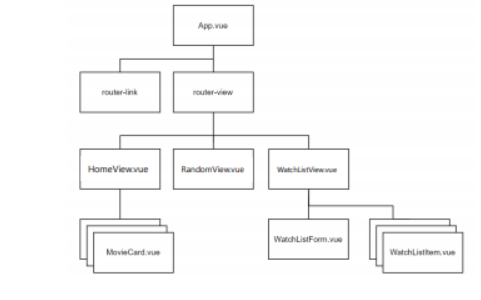
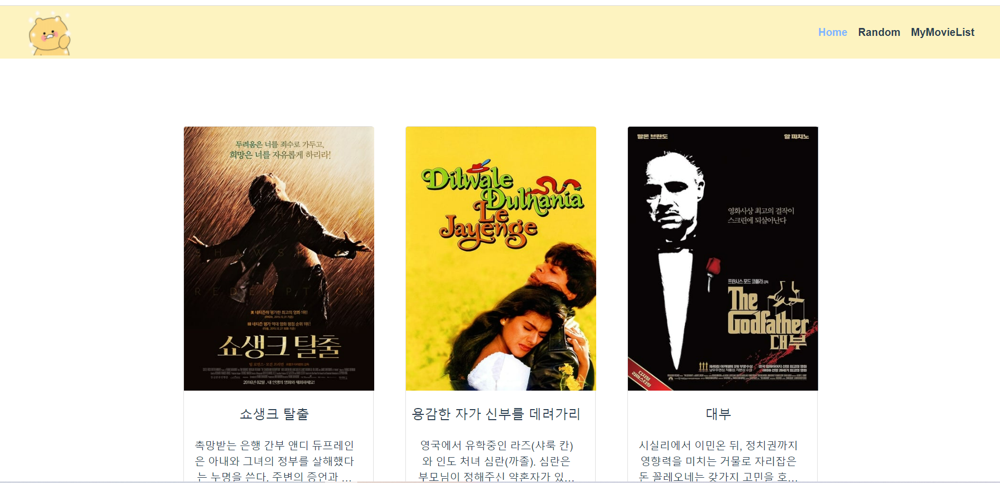
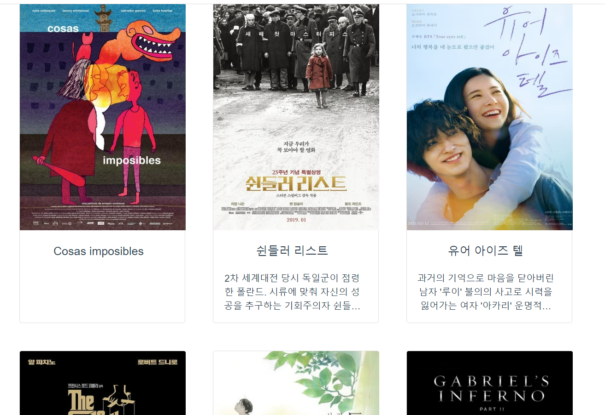
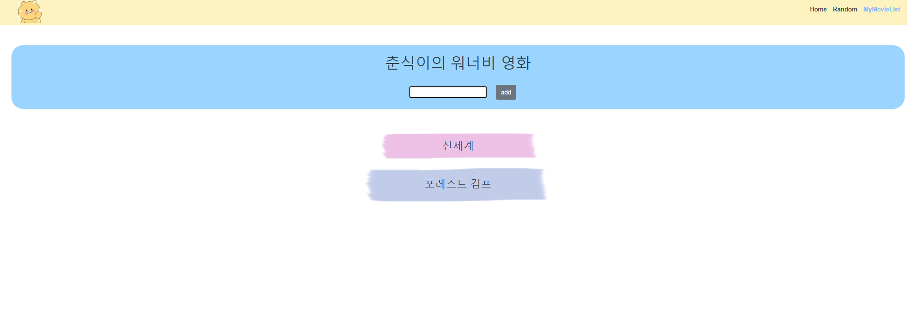
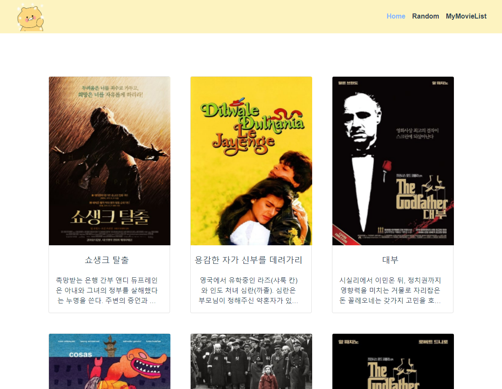
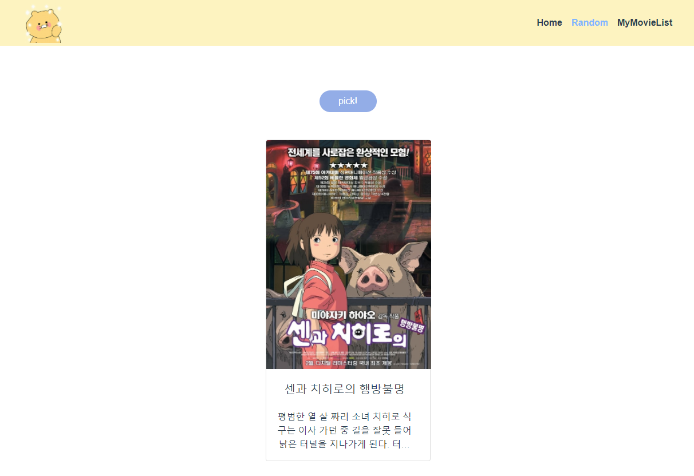
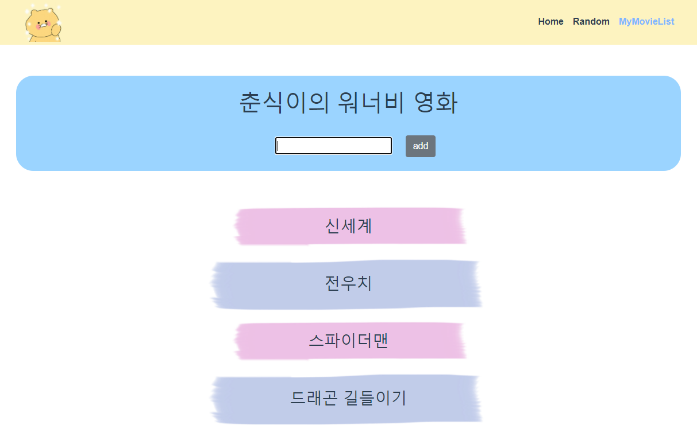

# PJT10

# 김동완

## 이번 ptj를 통해 배운 내용

### 목표

- 영화 정보를 제공하는 SPA 제작
- AJAX통신과 JSON 구조에 대한 이해
- Single File Component 구조에 대한 이해
- vue-cli, vuex, vue-router등 플러그인 활용
- Vuex 활용

### 개발도구

- Visual Studio Code
- Vue.js 2.X
- Node 16.X
- Chrome Brower

### 요구사항 

- 커뮤니티 서비스의 상세 기능 개발을 위한 단계로, 비동기 통신(AJAX)을 활용하여 사용자의
  UI/UX를 개선합니다.

### 컴포넌트 구조

### HomeView

### 진행과정

#### TMDB에서 영화 데이터 가져오기

- state에 movies를 담을 object를 정의해줍니다.

- Vuex actions에 getMovie 함수를 정의해줍니다.

- TMDB Base API_URL을 정의해주고, 기본 파라미터들을 정의해줍니다.
- axios를 요청을 보내고 성공하면 'GET_MOVIE' mutations에 결과를 담아서 push하게 합니다.
- GET_MOVIE에 커밋이 들어오면, state의 movies에 결과를 담아줍니다.

### HomeView에서 데이터 요청

- HomeView가 실행되면 바로 getMovie를 할 수 있도록, created()에 this.$store.dispatch('getMovie')를 실행되게 합니다.
- mapState를 이용해 담긴 영화를 가져옵니다.
- template에서 for문을 돌려, moviecard components를 실행하게 합니다.
- HomeView 템플릿은 하위 컴포넌트를 그리드 시스템으로 출력하기 위해, container 선언과 row div를 만들어줍니다.

### Moviecard component

- movie Object를 받은 후 props에 선언해주고, poster_path를 출력할 url을 computed에서 정의해줍니다.
- 각 card는 col을 3으로 주고, 적당한 마진을 줍니다.
- card 내부에는 computed로 계산된 url을 넣고, 영화 제목과, 줄거리를 넣어줍니다.
- 영화 줄거리는 매우 길기 때문에, css 중 overflow와 -webkit-line-clamp를 사용해서 3줄 이상일 경우 ... 처리가 되게 합니다.

### Pick

### 랜덤 영화 뽑기

### RandomView

- pick 버튼을 만들고, v-if 여부로 영화의 존재 유무에 따라 pick과 card가 출력되게 합니다.
- 카드의 크기는 HomeView에서 정의한 크기와 같게 만듭니다.
- pick button을 누르면 randomSelect 메소드가 실행되게 합니다.

### index.js

- methods의 randomSelect가 실행되면 getMovie actions가 실행됩니다.
- state에 movie 객체를 정의해놓습니다.
- getMovie action이 실행되면 영화 데이터를 가져오고, PICK_MOVIE mutations 으로 커밋합니다. 
- 커밋이 실행되면 state에서 정의된 movies와  lodash를 이용해 하나의 영화만 랜덤으로 추출합니다.
- computed 를 이용해 state의 movie를 가져온다.

### template

- 기본적인 형식은 HomeView와 똑같이 한다..

### MOVIE_LIST

### 부모 자식 형성하기

- component에 WatchListItem, WatchListForm를 만들어주고, WatchListView 컴포넌트에도 추가해준다.

### ListForm

- 데이터를 create할 input과 button을 만든다. 
- input은 v-model로 아래 method에서 동기되게 한다.
- data는 movieTitle로 정해두고
- enter나 클릭이 발생하면 createdMovie를 현재 movieTitle로 정의한다.
- 데이터가 있다면, wannabeMovie에 createdMovie를 담아서 보낸다.
- movieTitle input은 비워준다.

### Index.js

- state에 wannabes를 담을 
- wannabeMovie 요청이 들어오면 들어온 wannabe와 함께 WANNABE_MOVIE로 커밋한다.
- WANNABE mutation으로 커밋이 들어오면 wanabe를 wannabes에 push한다

### WatchListView

- mapstate로 vuex에서 wannabes를 가져온다.
- 해당 wannabes를 wannabe,idx를 for문으로 돌리고, wannabe_lst에 담아서 넘겨준다.

### WatchListItem

- watchListItem은 데이터를 받은 후 key의 odd/even 여부에 따라, 다른 색의 포스트잇이 출력되게 한다.

### 어려웠던 점 

- Vue Bootstrap을 이용해 card, navbar등을 작성하려 했으나, CSS가 꼬여 잘 되지 않았습니다.
  - 기본 Bootstrap을 이용해 해결할 수 있었습니다.
- Card grid시스템 정렬 과정에서 오류를 겪었습니다.
  - 개발자도구를 이용해 DOM구조를 식별한 후 해결할 수 있었습니다.
- 이미지 위에 글씨 쓰기가 잘 되지 않았습니다.
  - 구글링/페어와 아이디어 공유를 통해 해결할 수 있었습니다.

### 좋았던 점

- 멋진 네비게이터님이 지도를 해주셔서 쉽게 코딩할 수 있었습니다
- Vue 수업을 잘 따라가지 못했는데 처음부터 다시 해보면서 이해를 할 수 있었습니다.
- Vuex에 대한 이해도를 높일 수 있었습니다.

# 정아현

# pjt 10

> Vue를 활용한 SPA 구성

#### 🧐 T O D A Y

-  영화 정보를 제공하는 SPA 제작 
-  AJAX통신과 JSON 구조에 대한 이해 
-  Single File Component 구조에 대한 이해 
-  vue-cli, vuex, vue-router등 플러그인 활용

## 🧱 준비사항

- 언어
  1. Node 16.X
  2. Vue.js 2.X
- 도구
  1. Visual Studio Code
  2. Chrome Browser

## 🔨 기본 틀 잡기

- 컴포넌트 구조

  

- router

  - router view

  

## 🌎HomeView

> /URL과 매핑
>
> AJAX통신을 이용하여 다수의 영화데이터를 수집합니다.
>
> 수집한 영화데이터를 1개씩 Card형식으로  출력합니다.

#### TMDB

- TMDB의 top_rated API를 활용하여 평점이 높은 영화 20개를 가져왔습니다.
- store.action에서 비동기 요청으로 영화목록을 받아오고 mutation에서 해당 목록을 state의 movies array에 할당해주었습니다.

#### HomeView.vue

-  / URL과 매핑되는 컴포넌트입니다.
-  state에서 movies를 내려받았습니다.
-  home이 열리면 바로 영화목록이 생성되도록 created를 활용해 영화목록을 불러오는 action 'getMovie'를 dispatch 해주었습니다.
-  해당 영화목록은 v-for로 영화객체 하나씩 movieCard.vue로 내려가 카드 형태로 출력됩니다.

#### MovieCard.vue

- HomeView의 구성 component입니다.
- HomeView에서 내려온 movie객체 하나를 props로 내려받습니다.
- 해당 객체에서 영화 제목과 줄거리, 포스터 url을 뽑아 카드형태로 만들었습니다.
- 카드는 bootstrap에서 카드 모듈을 참고하였습니다.
- 포스터 url은 base url이 필요하기 때문에 computed에서 url함수를 따로 선언하여 return값을 활용했습니다.

## 🌟 random

> /random URL과 매핑
>
> Pick버튼을 클릭하면 무작위로 영화데이터 하나를 출력합니다.

#### Vuex.store

- home에서 활용한 action과 동일한 getMovie action을 사용했습니다.
- getMovie action에서 영화 목록을 불러오고 PICK_MOVIE mutation을 커밋합니다.
- PICK_MOVIE에서는 action에서 보내온 영화목록에서 lodash의 sample함수를 사용하여 하나를 뽑고 state의 movie객체에 할당합니다.

#### RandomView.vue

- /random URL과 매핑되는 컴포넌트입니다.
- randomSelect함수가 실행되면 store에서 getMovie를 디스패치 합니다.
- store.state에서 movie객체를 mapState로 받아옵니다.
- pick버튼을 누르면 randomSelect함수가 실행됩니다.
- 불러온 영화정보는 home의 MovieCard에서 활용한 것과 같은 card형식으로 만들어서 출력합니다.

## ✨MyWatchList

> / watch-list URL과 매핑
>
> 보고싶은 영화제목을 창에 입력하고 enter키 혹은 add버튼을 클릭하면 입력한 데이터가 출력됩니다.

#### Vuex.store

- states에 wannabes array를 선언
- string wannabe를 인자로 받는 wannabeMovie action에서 WANNABE_MOVIE mutation이 commit된다.
- WANNABE_MOVIE에서는  wannabeMovie action에서 받은 인자를 똑같이 받고, 그 string 인자를 wannabes array에 push해준다.

#### WatchMovieForm.vue

- input form과 button 을 활용하여 데이터를 입력받습니다.
- v-model로 입력한 데이터를 movieTitle와 동기화하고 @keyup.enter을 활용하여 enter를 입력했을때나, @click을 활용하여 button을 클릭했을때 inputMovie함수를 실행합니다.
- inputMovie함수는 movieTitle을 createdMovie에 할당하고, 입력값이 있으면 createdMovie를 인자로 하여 store의 wannabeMovie를 dispatch합니다.
- 해당 입력이 함수의 인자로 보내졌으니, 입력창은 비워줍니다.

#### WatchListView.vue

-  / watch-list URL과 매핑되는 컴포넌트입니다.
-  WatchListForm.vue와 WatchListItem.vue 두가지 컴포넌트로 구성됩니다.
-  mapState로 wannabes 배열을 가져오고 wannbe와 idx로 for문을 돌며 WatchListItem에 wannbe_lst라는 배열에 영화제목인 string값 wannabe와 number값 idx를 담아 보냅니다.

#### WatchListItem.vue

- props로 위에서 보낸 wannabe_lst를 받아오고, 해당 idx가 홀수이면 파란배경으로 영화제목을 출력하고, 짝수이면 분홍배경으로 영화제목을 출력합니다. 해당 구현은 v-if를 활용하였습니다.

## 💫 마무리

#### 어려웠던 점 + 배운 것들

- 먼저 Driver역할을 해주신 페어님께 많이 배울 수 있어 좋은 시간이었습니다. 
  - 처음 페어로 프로젝트를 진행해보았는데, 프로젝트를 진행하는 방식이 비슷했고, 중간중간 각자 어려운 부분을 서로 설명해줄 수 있어 좋았습니다.

- Vue와 Vuex 흐름을 다시 한 번 짚어볼 수 있어 좋았습니다.
- css부분에서 시간이 많이 소요되었습니다.
  - vue bootstrap을 잘 다루지 못해 결국 기본 bootstrap을 활용하였습니다.
  - grid system을 적용할 때 개발자도구에서 DOM구조를 뜯어보고 여러번 시도하여 해결하였습니다.
  - png파일을 text의 배경으로 넣어줄 때 .PNG형식은 되지 않는 것을 알았고 구글링을 통해 여러 방법을 시도해 볼 수 있었습니다. 
  - 해당 부분은 문서나 블로그를 더 찾아보고 적용해봐야 할 것 같습니다.

- v-if를 활용하려고 idx를 사용하고 싶었는데 이 과정에서 실수가 있었습니다. 
  - for문을 돌때 엘리먼트로 idx를 같이 작성해야 요소로 idx를 넘길 수 있는 것을 배웠습니다.

- 본 프로젝트에서 배운 것을 바탕으로 다음 프로젝트에서 실수를 줄일 수 있길 바랍니다.🙏🏻

