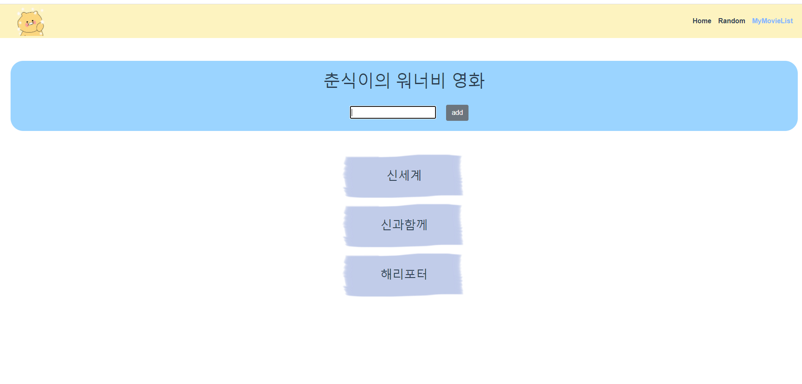

## 이번 ptj를 통해 배운 내용

### 목표

- 영화 정보를 제공하는 SPA 제작
- AJAX통신과 JSON 구조에 대한 이해
- Single File Component 구조에 대한 이해
- vue-cli, vuex, vue-router등 플러그인 활용
- Vuex 활용

### 개발도구

- Visual Studio Code
- Vue.js 2.X
- Node 16.X
- Django 3.2+
- Chrome Brower

### 요구사항 

- 커뮤니티 서비스의 상세 기능 개발을 위한 단계로, 비동기 통신(AJAX)을 활용하여 사용자의
  UI/UX를 개선합니다.

### 컴포넌트 구조

### HomeView

### 진행과정

#### TMDB에서 영화 데이터 가져오기

- state에 movies를 담을 object를 정의해줍니다.

- Vuex actions에 getMovie 함수를 정의해줍니다.

- TMDB Base API_URL을 정의해주고, 기본 파라미터들을 정의해줍니다.
- axios를 요청을 보내고 성공하면 'GET_MOVIE' mutations에 결과를 담아서 push하게 합니다.
- GET_MOVIE에 커밋이 들어오면, state의 movies에 결과를 담아줍ㄴ디ㅏ.

### HomeView에서 데이터 요청

- HomeView가 실행되면 바로 getMovie를 할 수 있도록, created()에 this.$store.dispatch('getMovie')를 실행되게 합니다.
- mapState를 이용해 담긴 영화를 가져옵니다.
- template에서 for문을 돌려, moviecard components를 실행하게 합니다.
- HomeView 템플릿은 하위 컴포넌트를 그리드 시스템으로 출력하기 위해, container 선언과 row div를 만들어줍니다.

### Moviecard component

- movie Object를 받은 후 props에 선언해주고, poster_path를 출력할 url을 computed에서 정의해줍니다.
- 각 card는 col을 3으로 주고, 적당한 마진을 줍니다.
- card 내부에는 computed로 계산된 url을 넣고, 영화 제목과, 줄거리를 넣어줍니다.
- 영화 줄거리는 매우 길기 때문에, css 중 overflow와 -webkit-line-clamp를 사용해서 3줄 이상일 경우 ... 처리가 되게 합니다.

### Pick

### 랜덤 영화 뽑기

### RandomView

- pick 버튼을 만들고, v-if 여부로 영화의 존재 유무에 따라 pick과 card가 출력되게 합니다.
- 카드의 크기는 HomeView에서 정의한 크기와 같게 만듭니다.
- pick button을 누르면 randomSelect 메소드가 실행되게 합니다.

### index.js

- methods의 randomSelect가 실행되면 getMovie actions가 실행됩니다.
- state에 movie 객체를 정의해놓습니다.
- getMovie action이 실행되면 영화 데이터를 가져오고, PICK_MOVIE mutations 으로 커밋합니다. 
- 커밋이 실행되면 state에서 정의된 movies와  lodash를 이용해 하나의 영화만 랜덤으로 추출합니다.
-  computed 를 이용해 state의 movie를 가져온다.

### template

- 기본적인 형식은 HomeView와 똑같이 한다..

### MOVIE_LIST

